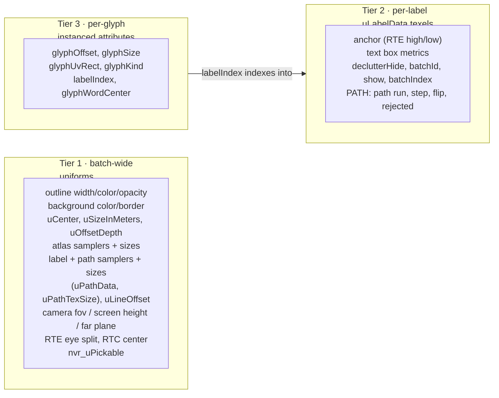

# Text Batching

How `@navaramap/three` draws every text label in a tile-layer with a **single
draw call**, how a label can change its text without rebuilding the batch, and
how a label is bent along a line ([Line placement](#line-placement)). For the
placement pass that decides which of those labels stay visible, see
[DECLUTTER.md](DECLUTTER.md); for the broader pipeline, see
[ARCHITECTURE.md](ARCHITECTURE.md).

## Overview

One `BatchedSdfTextMesh` is created per Rust `TextMesh` event — i.e. per
tile, per layer (`event/features/text.ts`). It owns exactly one
`InstancedBufferGeometry` and one `ShaderMaterial`, and renders through one
`drawArraysInstanced(TRIANGLES, 0, 6, N)`: a shared unit quad, `N` instances.

**An instance is a glyph, not a label.** A tile with 60 labels averaging 5
glyphs each is one draw call with ~360 instances, not 60 draw calls.

That single-call constraint is the whole design pressure. A draw call is
bounded by one geometry plus one material, so anything that varies inside it
must be indexable per-instance. Uniforms are constant for the entire call —
which is why the batch's data is split three ways.

## The three tiers

Every value the shaders need falls into exactly one tier. Getting a value into
the wrong tier is the main way to break batching, so the split is worth
knowing before touching either shader.



Per-*feature* style — color, opacity, font size, height, orientation,
rotation — is not in any of the three. It lives in the shared batch data
texture, keyed by the feature index the label carries in `STATE.w` (see
[BATCH_TEXTURE.md](BATCH_TEXTURE.md)); a feature can own several labels
(MultiPoint, along-line repeats), so the label rows only hold what differs per
anchor.

**Tier 1** works because a batch is already keyed by `(font, quality)` and
built from one material — these were never actually per-label. Text quality is
immutable per batch for the same reason: all labels sample one atlas, so
flipping it requires a new batch.

**Tier 3** is ordinary instancing.

**Tier 2** is the interesting one: an instance is a glyph, but these values
vary per *label*, and a label owns many glyphs. The `labelIndex` attribute is
the join key — a foreign key from a glyph to its label's row block.

## The label data texture

Per-label state lives in an unfiltered `RGBAFormat` + `FloatType` `DataTexture`
that the **vertex** shader reads with `texelFetch`
(`mesh/sdfText/labelData.ts`). Five texels per label:

| row | x | y | z | w |
| --- | --- | --- | --- | --- |
| 0 `POSITION_HIGH` | anchor high .x | .y | .z | *(reserved)* |
| 1 `POSITION_LOW` | anchor low .x | .y | .z | *(reserved)* |
| 2 `BOX` | textWidth | textHeight | bgMinY | bgMaxY |
| 3 `STATE` | declutterHide | batchId | show | batchIndex |
| 4 `PATH` | first texel of the path run | metres between samples | flip | rejected |

Rows 0–1 carry the RTE high/low anchor split (see
[RTC_VS_RTE.md](RTC_VS_RTE.md)); in RTC mode row 0 holds the tile-relative
position and row 1's `xyz` is unused. The layout is identical across both so
the shader's row indices never branch. `STATE.w` is the feature index into the
batch data texture. `PATH` is all zero unless the label sits on a line (see
[Line placement](#line-placement)).

Addressing is a linear texel index over a **fixed-width** texture, mirroring
`fogLight.frag.glsl`:

```glsl
vec4 nvr_readLabel(int slot, int row) {
    int i = slot * LABEL_ROWS + row;
    return texelFetch(uLabelData, ivec2(i % uLabelTexSize.x, i / uLabelTexSize.x), 0);
}
```

The width is fixed (64 texels) precisely so growth only changes the height —
an existing label's address stays valid across a resize, and the old data is
copied straight in.

`LabelRow` and `LABEL_ROWS` live with the **enhancer**
(`material/enhancer/sdfText/sdfTextBaseEnhancer/types.ts`), not with the
texture, because they are a shader contract: the enhancer injects `LABEL_ROWS`
as a GLSL define, so the CPU row table and the shader's stride cannot drift.
The individual row indices are restated in GLSL as `LABEL_ROW_*` defines;
`shader.test.ts` pins those against `LabelRow`, and that the rows form a dense
`0..n-1` range.

`setComponent` skips a write whose value is already stored, so a placement
pass that rewrites every label's unchanged decisions requests no upload.

> **Why a texture rather than replicating per-label values onto every glyph
> attribute?** Both render identically, but replication makes a per-label
> change cost O(glyphs). The declutter fade runs every frame; through the
> texture a fade step is one float per label regardless of glyph count. It also
> decouples the two allocations — when a text change relocates a label's glyph
> run, its label row does not move.

## Glyph runs and the slot allocator

Each label owns a **contiguous run** of glyph instance slots handed out by
`GlyphSlotAllocator` (`mesh/sdfText/glyphSlots.ts`). Run capacities are rounded
up to powers of two (floor 4), with a free list per size class.

This is what makes variable-length text cheap:

```ts
realloc(run, count) {
  if (run && capacityFor(count) === run.capacity) return run;  // same slots
  if (run) this.free(run);
  return this.alloc(count);
}
```

- **Same size class** (`"Paris"` → `"Lyon"`): the run is returned unchanged.
  The caller overwrites in place and blanks the leftover tail.
- **Class change**: the old run goes back to its free list, a new one is taken,
  and the vacated slots are blanked.
- Either way only that label's slots are rewritten, and the GPU upload is a
  `bufferSubData` of exactly that range via `addUpdateRange`.
- **Growth** doubles the buffers and is the only path that re-uploads
  everything. It is amortized O(1).

Worst-case internal fragmentation is 2×. That is the deliberate price of never
relocating a label that merely changed length; there is no compaction pass, and
none should be added without a measurement showing it matters.

`geometry.instanceCount` tracks the allocator's high-water mark, so the draw
covers holes left by freed runs as well as live runs. Both are blanked, which
is what the fourth `glyphKind` value is for.

## `glyphKind`

One float per instance encodes four roles (`GlyphKind` in
`mesh/sdfText/glyphBuffers.ts`, mirrored by the `GLYPH_KIND_*` defines in
`sdfText.vert.glsl`):

| value | meaning |
| --- | --- |
| `0` SDF | sample the single/multi-channel SDF atlas |
| `1` COLOR | sample the COLRv1 RGBA atlas — lets one batch mix text and emoji |
| `2` BACKGROUND | one strip of this label's background (see below) |
| `3` EMPTY | unused tail of an over-allocated run, or a hole from a freed run |

`EMPTY` is culled on the first line of `main()`, before any texture read. New
buffer capacity is explicitly filled with `EMPTY`: a zero-filled array would
read as `SDF` and draw garbage quads.

`BACKGROUND` always occupies the first slots of the run, so a label's
background is submitted before its own glyphs. The fragment shader's
outline-seam fix depends on that ordering. Whether it actually draws is a
batch-wide `uShowBackground` test in the shader, so toggling backgrounds costs
no buffer writes.

The background is `backgroundSliceCount(glyphs)` strips rather than one quad,
so a flat label's box can bend with the globe (see
[Quad orientation](#quad-orientation)). Each strip stores its span of the box
as `[0, 1]` fractions, the start in `glyphOffset.x` and the **end** (not a
width) in `glyphSize.x`, so neighbouring strips share bit-identical edges. The
vertex shader remaps `vAtlasUv.x` to that span, and since the fragment shader
draws fill and border from the UV alone, the split is pixel-identical to a
single quad.

## Quad orientation

A glyph's vertex position is its unit quad offset from the label's anchor **in
view space**: `mvPosition + vec4(localPos.x * right + localPos.y * up, 0.0) *
scaleFactor`. All four orientation modes differ only in that `(right, up)`
pair, which `nvr_quadOrientation` resolves from two booleans —
`uFlatFacing` picks the plane, `uRotateWithCamera` picks whether the quad
follows the camera or is frozen in the anchor's east-north-up frame:

| `uFlatFacing` | `uRotateWithCamera` | right, up | behaviour |
| --- | --- | --- | --- |
| `false` | `true` | view `+x`, `+y` | screen-aligned billboard (the default) |
| `false` | `false` | east, surface normal | signboard standing on the surface |
| `true` | `true` | screen `+x` projected onto the tangent plane | lies on the surface, yawed to keep reading left-to-right |
| `true` | `false` | east, north | lies on the surface, pinned north-up |

A zero-Z offset is exactly what makes a quad screen-aligned, so only the first
row is camera-relative; the rest rotate a *world* direction into view space
(`viewMatrix * vec4(dir, 0.0)`, the idiom `mvr_getMvHeightOffset` already uses).
The surface normal is `normalize(absTransformed)` — the same spherical
approximation as the height offset, reusing the ECEF position horizon culling
already reconstructed.

The two `uRotateWithCamera == false` rows share one branch: both are the
anchor's east-north-up frame, differing only in whether up is north (flat) or
the surface normal (upright). Because neither reads the camera, the basis is a
pure function of the anchor and has no camera-dependent singularity.

The orientation resolver lives in `chunks/quad_orientation.glsl`, shared with
`instancedSprite.vert.glsl` so labels and sprites cannot drift apart. It takes
the two booleans and the rotation as **parameters** rather than reading
uniforms, which is what lets them arrive either way — see below.

**These three are per-feature, not batch-wide.** The uniforms
(`uFlatFacing`, `uRotateWithCamera`, `uRotation`) are only the material-level
default: the shader seeds its locals from them, then
`chunks/batch_texture_vertex.glsl` overwrites those locals from the batch data
texture when a feature has its own value (see
[BATCH_TEXTURE.md](BATCH_TEXTURE.md)). The two booleans share one texel
component through `packOrientation`, the same trick `showOpacity` uses.

One subtlety this forced: `USE_BATCH_*` is a **material-wide** define, so the
moment one feature is given its own rotation, every feature starts reading the
slot. Features nobody styled must therefore already hold what the uniform was
giving them, which is why `ensureRotationSlot` / `ensureOrientationSlot`
backfill from the material's current value instead of a fixed constant. The
mesh supplies those values as a typed `BatchAttributeDefaults` argument to
`updateBatchAttribute` (`ensureShowOpacitySlot` does the same with
`material.visible`).

`nvr_quadBasis` then spins that basis by the rotation (converted from the material's
degrees to radians CPU-side) **inside the quad's own plane**, turning both axes together. Because it composes with the resolved
basis rather than replacing it, one implementation covers every mode: it spins
a billboard on screen and swings a surface label like a compass bearing, and
the quad never leaves the plane its mode put it in. The sine is negated
relative to the usual counter-clockwise matrix so a positive angle reads
clockwise from in front, matching compass bearings and MapLibre's
`text-rotate`.

The pivot is the **anchor**: glyph offsets are measured from it once `uCenter`
has shifted the text block, so `center` is what decides where inside the text
the label turns about — `{x: 0.5, y: 0.5}` spins it about its middle,
`{x: 0.5, y: 0.0}` about the bottom of the block.

Flat labels are then **wrapped onto the globe** by `nvr_quadOffset`: each
vertex's tangent-plane offset is walked the same distance along the great
circle it points down (the sphere's exponential map), instead of being added
as a straight line. A tangent plane touches the surface only at the anchor and
rises off it as `d² / 2R`, which is nothing for a street-scale label, but a
pixel-sized label seen at globe scale can be thousands of kilometres wide, and
its ends would otherwise float off the surface and past the limb. The bend is
per vertex, so every quad remains a flat chord between its bent corners. For a
glyph that chord is short enough to ignore, but a single background quad would
stay straight while the text above it curved, so the text rose out of its box
in the middle. The background is therefore drawn as side-by-side strips, one
per two glyphs and capped at 8 (`backgroundSliceCount`), each about glyph-wide
and bending the way the glyphs do.

Strips and glyphs are still chords with *different* endpoints, so they are no
longer exactly coplanar, and glyph outlines only draw over the background
because they share its depth (see the depth notes in `sdfText.frag.glsl`).
Wherever a glyph dipped below its strip, the outline lost the depth test and
the background showed through it. A flat label's strips are therefore pushed
back along the view ray by twice their chord's sagitta (`s² / 4R`, added to
`vFragDepth` in meters), which bounds the mismatch. The push is zero for upright
labels and negligible at street scale.

> **`rotateWithCamera` must not be implemented as a screen-space spin.** An
> earlier revision gave the screen-plane quad an up vector of *north projected
> onto the screen*. That inverts every label whenever the camera faces south —
> north then points down-screen — and its direction is undefined outright when
> north lies along the view axis. Freezing the quad in the world frame, as
> above, is what makes the mode well-posed.

Two consequences worth knowing:

- **The background strips share the basis and the bend**, so the box stays
  on the same surface as its glyphs in every mode.
- **A world-frozen quad has a back and an edge.** `textFacing: "upright"` with
  `rotateWithCamera: false` is a real signboard: invisible edge-on from
  directly above, and mirrored when viewed from behind. That is inherent to a
  fixed-orientation quad, not a defect. Its face points south, so the default
  north-looking camera reads it.
- **The batch material is `DoubleSide` by default**, as is
  `InstancedSpriteMesh`'s. The material's `backfaceCulling` option switches
  both to `FrontSide` (the enhancer's `updateMaterialProps` owns `side`).
  Culling would delete a world-locked quad outright as soon as the camera
  crossed to its far side, which is the case where a mirrored quad is usually
  the wanted result, so it stays opt-in. Opting in is useful for flat quads:
  their front faces away from the globe, so the triangles of a large flat
  label or sprite that wrap over the horizon face away from the camera and
  are culled one by one, trimming it at the limb (horizon culling itself only
  tests the anchor). An upright camera-following quad never presents a back
  face, and `screenSpaceNormal()` in both fragment shaders already flips an
  away-facing normal before it reaches the G-buffer.
- **A point label's declutter box is its unrotated block.** The Rust kernel
  projects the anchor and scales the label's em box by pixels-per-meter
  (`crates/navara_wasm_api/src/declutter.rs`), ignoring the basis above. That
  over-estimates a foreshortened flat or frozen label, which is conservative,
  but does not follow `rotation`: a rotated label can overrun its box. Line
  labels are the exception — the line-placement pass hands declutter the
  rotated box they actually cover (see [Line placement](#line-placement)).

### Along a line

A label with a non-zero `PATH.y` skips `nvr_quadBasis` entirely. Its basis
comes from the line under each **word**, not from the camera, so `rotation` and
`rotateWithCamera` do not apply; facing still picks the plane:

| facing | right | up |
| --- | --- | --- |
| upright | path tangent | surface normal |
| flat | path tangent | ground normal (tangent turned 90° left) |

The walk is word-rigid. `glyphWordCenter` (the centre of the glyph's word, in
ems, identical for every glyph in the word; filled by `layout.ts`, which closes
a word only at shaper whitespace) gives an arc length `s` from the anchor,
negated when `PATH.z` flips the label. Samples are a uniform `step` apart, so
the segment is `floor((s + halfSpan) / step)`: two texel fetches, no loop. The
interpolated point plus `uLineOffset` along the ground normal places the word;
its glyphs are then laid along that one segment's tangent from the word's
centre. Per-glyph tangents would splay the letters of a word apart on a tight
bend, and quads are never bent per vertex.

For a flat label the path offset and the glyph's offset within its word are
summed and wrapped **once** by `nvr_wrapOffset` (the wrap step of
`nvr_quadOffset` on its own). Wrapping them separately and adding the results
would leave the path part planar, rising off the globe with its length.

Along-line labels draw no background. A bent ribbon cannot be expressed as
quads, so `BACKGROUND` instances are culled when `PATH.y > 0`. A plain point
sharing the batch (`geometryTypes: ["point", "line"]`) has `PATH.y == 0` and
lays out as an ordinary label, background and all.

Sprites placed along a line take a different route through the same chunk:
the line's bearing arrives as the per-instance `instanceBearing` attribute
(`USE_INSTANCE_BEARING`) and is added to the rotation `nvr_quadBasis` spins by.

## Line placement

With `placement: "line" | "line-center"`, a label is laid along the line its
anchor was placed on (MapLibre's `symbol-placement`). The work is split by when
each answer can be known.

**Parse time** (`crates/navara_parser/src/line_placement.rs`, called from the
MVT and GeoJSON parsers). `LinePath::anchors` places anchors at **nested
levels**: level `l` repeats every `finest · 2^l` along the line, centred on its
midpoint, and each level's positions are a subset of the finer one's, so
zooming out only drops anchors, never moves them. The midpoint belongs to
every level and is the only anchor of `line-center`. Each anchor carries a
**scale band**, the `(min, max]` ground metres per pixel over which its level
is the one shown, so the on-screen gap stays between one and two `spacing`.
Text anchors are *banded*: a position gets one anchor per level it belongs to
(its "stack-mates", adjacent instances with an identical anchor), each with a
path sized for its own level. Each text anchor also carries `PATH_SAMPLES`
(32) east/north metre offsets from the anchor, neighbours a uniform straight
**chord** `step` apart across twice its level's spacing and extrapolated past the
line's ends, plus `(step, metres of real line either side)`. Plain points in
the same group get a zero step and an always-shown band.

**Upload.** The path texture (`uPathData`) is a second `LabelDataTexture` with
`PATH_SAMPLES / 2` texels per slot (two samples per RGBA texel) and 64 labels
per row. A label's own slot addresses its path run, so there is no second
allocator; `PATH.x` is that run's first texel. `NVR_LINE_PLACEMENT` and
`PATH_SAMPLES` are injected as defines only when the engine actually sent a
path, derived from the data's stride, and both are part of the program cache
key. The batch keeps the path (`_path`) apart from its positions, since a
terrain-height update re-sends positions without it. The `spacing` the bands
were built for is fixed per batch.

**Per pass** (`placeLineLabels`, called by `DeclutterManager` before it
collects candidates, whether or not the layer declutters; see
[DECLUTTER.md](DECLUTTER.md)). Only along-line labels that could become
declutter candidates (visible batch, shown, shaped text) are judged; this
filter relies on the same dirty-marking as `collectDeclutterCandidates`, so the
two predicates must stay identical. The Rust
kernel (`crates/navara_wasm_api/src/line_label.rs`) mirrors the vertex shader's
sizing and runs in two phases:

1. `lineLabelFit`, over a compact row with no path samples: the anchor's level
   must be the one on screen (the requested spacing stretches when the label is
   longer than about ¾ of `spacing`, as MapLibre does), and the text's reach
   from the anchor must fit within the real line and the sampled span. Most
   labels on a dense view fail here, so their paths never cross the boundary.
2. `lineLabelPlace`, for the survivors with their paths: the flip, the
   `maxAngle` test (the turn summed over a sliding window of about 1.5 em must
   stay under the limit), and the rotated screen-axis box (`path_box`, built
   segment by segment the way the shader places words, in the font size's
   units around the anchor). It repeats the fit test rather than trusting
   phase one.

Then `findRepeatedLabels` (in `linePlacement.ts`) drops a label whose text
already has an accepted anchor in the batch closer than half the spacing,
keeping the first in anchor order. It runs last, so a label rejected for its
angle cannot have hidden its neighbour first. Results land in `PATH.z` / `.w`
and in `_lineBoxes`, which `collectDeclutterCandidates` uses in place of the
unrotated block.

Invariants that keep this flicker-free:

- **Culled until placed.** `_writePath` writes `PATH.w = 1`, because an
  unjudged label has no flip yet and would read backwards for a frame. Hiding
  a label (`_recomputeShow`) sets it back to 1, since a hidden label is not
  placed and its last decision is stale by the time it shows again. A rejected
  label is *culled* in the
  shader, not faded: it is not a contest a pixel of drift could win back. An
  invisible batch is never placed, so `setActive` on a batch with a path calls
  `declutter.markDirty(true)` to lift the throttle.
- **Flip hysteresis.** `should_flip` scores the on-screen reading direction
  against a half-plane tilted slightly off vertical (a near-vertical label
  reads bottom-to-top) with a deadband (`FLIP_HYSTERESIS`). The current flip
  is read back from `PATH.z`, so a label on the boundary keeps its direction.
- **Level handoff.** When a pass newly rejects a label, `_handOffLineLabel`
  copies its declutter hide and target to the stack-mate this pass newly
  accepted. Without the copy, every crossing of a level boundary would snap the
  old label out and fade the new one in along every line on screen.
- **Rejected labels are not incumbents.** The declutter pass never sees a
  rejected label, so `_hideRejectedLineLabel` snaps its declutter state to
  hidden. When it fits again it competes as a fresh candidate, not with a
  stale "shown" claim.

Sprites use the same anchors unbanded (one per position, shown up to its
coarsest level, no path) and only the scale and box half of the kernel,
`lineAnchorPlace`, from `InstancedSpriteMesh.placeLineLabels`.

## Picking

`sdfText.frag.glsl` deliberately does **not** include
`chunks/batch_definition.glsl`, which declares `nvr_uBatchId` as a uniform —
that only works when one material draws one feature. The batch id instead
travels per-label (`STATE.y`) into a `flat varying vBatchID`, the same approach
`instancedSprite.frag.glsl` takes. `nvr_uPickable` stays a uniform because pick
mode is batch-wide.

## Gotcha: three caches the instance ceiling

> three.js sets `geometry._maxInstanceCount` on the **first** VAO bind (guarded
> by `=== undefined`) and only clears it when the geometry is *disposed*. Every
> draw then clamps to `min(geometry.instanceCount, geometry._maxInstanceCount)`.

Replacing instanced attributes with larger ones — the normal way to grow a
pooled instance buffer — does **not** raise that ceiling. Without intervention
a batch stays pinned to whatever capacity it had when it was first rendered,
and every label added afterwards silently never draws.

`GlyphBuffers.ensureCapacity` therefore deletes the cached field after growing.
There is no public API for this; deleting it is what three itself does on
dispose.

This fails silently — no console error, `geometry.instanceCount` reads correct
on the JS side, and the draw call is still issued. The symptom that identifies
it: content renders correctly when the object is **recreated** (its buffers
grow before the first render) but not on the original load path. Confirming it
requires reading the instance count at the GL level, e.g. patching
`drawArraysInstanced` and logging its last argument.

## Constraints and trade-offs

- **Draw order.** Labels paint in slot order, not three's back-to-front
  transparent sort. `depthTest` + `depthWrite` + the fragment shader's
  `gl_FragDepth` writes resolve overlaps, and decluttered labels do not overlap
  by construction. Only overlapping labels with `depthTest: false` *and*
  declutter off are affected. MapLibre and deck.gl make the same trade.
- **`frustumCulled` stays `false`.** Geometry positions are unit quads and the
  real transform happens in the shader, so a three.js bounding sphere would be
  meaningless. Horizon culling in the shader covers the far side of the globe.
- **Labels are created lazily** on the first per-feature setter, keyed by a
  sparse `batchIndex → label` map. MVT tiles routinely carry thousands of
  features where only a handful get text; sizing eagerly to the anchor count
  would waste hundreds of KB per tile.
- **A changed material field overwrites per-feature style.** Engine change
  events re-send the whole material, so `_applyUpdate` compares against the
  previous one and writes only the fields that actually changed to every
  label, clobbering evaluator overrides for those fields alone.

## Key files

| File | Role |
| --- | --- |
| `shaders/glsl/sdfText.vert.glsl` | `nvr_readLabel` / `nvr_readPath`, the `GLYPH_KIND_*` culls, RTE/RTC transform, the along-line word walk |
| `shaders/glsl/chunks/quad_orientation.glsl` | `nvr_enuBasis`; `nvr_quadOrientation` / `nvr_quadBasis` — the orientation basis; `nvr_quadOffset` / `nvr_wrapOffset` — the vertex offset, wrapped onto the globe when flat. Shared with instancedSprite |
| `shaders/glsl/sdfText.frag.glsl` | SDF/MTSDF and COLRv1 sampling, outline, background, pick encoding via `vBatchID` |
| `web/navara_three/src/mesh/sdfText/batchedSdfText.ts` | `BatchedSdfTextMesh` — label records, the engine/evaluator API, declutter participation, `placeLineLabels`, atlas retain/release |
| `web/navara_three/src/mesh/sdfText/linePlacement.ts` | Packing for `lineLabelFit` / `lineLabelPlace` (the stride contract with Rust), `takeLinePath`, `findRepeatedLabels` |
| `crates/navara_wasm_api/src/line_label.rs` | The line-placement kernel: fit, flip, max angle, rotated box; `lineAnchorPlace` for sprites |
| `crates/navara_parser/src/line_placement.rs` | Parse-time anchors: nested levels, scale bands, `PATH_SAMPLES` chord-sampled paths |
| `web/navara_three/src/mesh/sdfText/glyphBuffers.ts` | Instance attributes, partial uploads, capacity growth, `GlyphKind` |
| `web/navara_three/src/mesh/sdfText/glyphSlots.ts` | `GlyphSlotAllocator` — size classes, free lists, `realloc` |
| `web/navara_three/src/mesh/sdfText/labelData.ts` | `LabelDataTexture` — addressing, writes, growth; also backs the path texture |
| `web/navara_three/src/mesh/sdfText/layout.ts` | Pure layout: line breaking, RTL direction, shaping result → glyph quads, word centres |
| `.../enhancer/sdfText/sdfTextBaseEnhancer/types.ts` | Batch-wide props/state/refs, plus `LabelRow` / `LABEL_ROWS` (the shader contract) |
| `web/navara_three/src/event/features/text.ts` | Creates one batch per Rust `TextMesh` event |
| `web/navara_three/src/mesh/sprite/instancedSprite.ts` | The sibling batched mesh; text follows its conventions |
